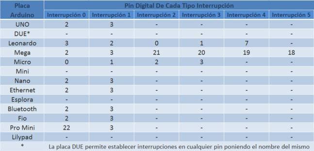

_Apuntes de un Ingeniero Electronico_
<br>
⋅⋅⋅⋅⋅⋅⋅⋅⋅⋅⋅⋅⋅⋅⋅⋅⋅⋅⋅⋅⋅⋅⋅⋅⋅⋅⋅⋅⋅⋅⋅⋅⋅⋅⋅⋅⋅⋅⋅⋅⋅⋅⋅⋅⋅⋅⋅⋅⋅⋅⋅⋅⋅⋅⋅⋅⋅⋅⋅⋅⋅⋅⋅⋅⋅⋅⋅⋅⋅⋅⋅⋅⋅⋅⋅⋅⋅⋅⋅⋅⋅⋅⋅⋅⋅⋅⋅⋅⋅⋅⋅⋅⋅⋅⋅⋅⋅⋅⋅⋅⋅⋅⋅⋅⋅⋅⋅⋅⋅⋅⋅⋅⋅⋅⋅⋅⋅⋅⋅⋅⋅⋅⋅⋅⋅⋅⋅⋅⋅⋅⋅⋅⋅⋅⋅⋅⋅

# __ARDUINO__


### Que son Interrupciones
Como su nombre lo indica es interrunpir el loop del programa mediante un pulsador o un medio externo, de esta manera obliga al controlador atender un nuevo evento. Una vez terminada la interrupcion volvera al punto donde estaba antes de producirse.


### Como Hacer Interrupciones

Cada placa tiene algunos puertos disponibles para hacer interrupciones por hardware.   


Aqui se muestra una imagen con los pines que se pueden hacer interrupciones en cada placa.
<p align="center">

</p>


### Descripcion del comando   


* ```attachInterrupt(pbIn, stateChange, CHANGE);```

+ Activa las interrupciones (despues de haberlas desactivado con ```nointerrupts()```)

+  Las interrupciones permiten que se ejecuten ciertas tareas en segundo plano que estan activadas por defecto.

- Algunas funciones no funcionan correctamente mientras las interrupciones esten desactivadas y la comunicacion entrante puede ser ignorada. Las interrupciones pueden perturbar ligeramente la temporizacion en el codigo y deben ser desactivadas solo para pates particularmente criticas del codigo.


### Ejemplo en ARDUINO  


```c
void setup ()
{

}
void loop ()
{
  attachInterrupt(pbIn, stateChange, CHANGE);
  //codigo critico y sensible al tiempo interrupts()
  //otro codigo

}

```


### Trabajando con Arduino UNO R3

el comando ```attachInterrupt(A, B, C);``` tiene tres Parametros.


* En el parametro "A" va el pin que vamos hacer la interrupcion, en este caso puede ser el pin 2 o 3.
+ En el segundo parametro va la funcion que queremos que se ejecute mientras se ejecuta la interrupcion.
+ En el tercer parametro va el CAMBIO y existe 4 tipos de cambios, tales como:

1. __LOW__ :       La interrupción se activa cuando el valor de voltaje del pin elegido es bajo, esto es, 0V.

2. __CHANGE__ : La interrupción se activa cuando el pin cambia de valor, es decir, cuando pasa de LOW a HIGH o de HIGH a LOW.

3. __RISING__ :Se activa únicamente cuando el valor del pin pasa de LOW a HIGH.

4. __FALLING__: Es el caso opuesto al modo RISING. Se activa la interrupción cuando el valor pasa de HIGH a LOW.

5. __HIGH__ :Este modo solo está disponible en la placa DUE y funciona de manera opuesta al modo LOW, es decir, se activa cuando el valor de voltaje del pin es alto.


Estos ultimos parametros dependen de como se encuentre el pulsador o el pulso o como queremos tomarlo.   
