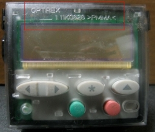
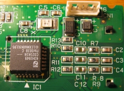

_Apuntes de un Ingeniero Electronico_

# LCD LEXMARK


<p align="center">

</p>

Lexmark/Optrex T612/T622 11K0627/11K0628 Display w/ Keypad and Control Panel, esta es una placa que contiene una LCD 16x2, ademas botones de control y un led, para comunicacion con la lcd se debe hacer por i2c.      


__Informacion de pines__

PIN1:  I2C Data  
PIN2:  +5V DC  
PIN3:  I2C Clock  
PIN4:  Ground  
PIN5:  FPIRQ  
PIN6:  No Connection  

La placa contiene 5 pines, pero el 6 no esta conectado, como se muestra en la siguiente figura.

<p align="center"> 
</p>


## Ejemplo en ARDUINO  


```c
// Code to clear the LCD:

#include "mbed.h"

I2C i2cname(p9, p10)                                         // SDA and SCL Pin Number.

int main()
{
     i2cname.frequency(400000);                              // NOT necessary. Default I2C speed is 100kHz, Fast mode is 400kHz.

     char buffer[2];                                         // Create an array for storing the data read.
     char command[] = {0x88, 0x00, 0x00};                    // Send command 0x00, 0x00 to register 0x88 to CLEAR the LCD.

     i2cname.write(0x42, command, sizeof(command));          // Send the command to device located at 0x42.
     i2cname.read(0x43, buffer, 2);                          // Read 2 bytes from the device to ensure LCD operates correctly.


```


************************************************
###Instalar Apache
Para instalar apache debes ejecutar el siguiente comando

`yum install httpd`

se vera algo parecido a esto


este comando se ejecuto logueado como usuario root, si no estas logueado como root y no lo deseas hacer puedes anteponer el comando `sudo`


###Instalar PHP

El comando mas basico para instalar la ultima version de PHP es el siguiente:

`yum install php`

Sin embargo, como lo que se pretende es configurar un servidor web, el comando mas usado es teclear el comando.

`yum install php php-mysql`

Este modulo permite la conexion con mysql.

una vez que se pida la confirmacion de la descarga e instalacion, saldra un mensaje con los modulos instalados.


Con esto, se tendra un PHP y Apache funcional,

Si se desean instalar mas modulos, simplemente  se ingresa cada uno separado por un espacio. Por ejemplo.

`yum install php-common php-cli php-devel php-fpm php-gd php-imap php-intl php-mysql php-process php-xml php-xmlrpc php-zts`

Para que el servidor recargue los nuevos modulos, se debe reiniciar.

`service httpd restart`

Para iniciar el servidor Apache cada vez que el equipo se reinicie, ingresar el siguiente comando:

`chkconfig httpd on`

Para verificar que funciona nuestro servidor web, tan solo se necesita acceder via navegador a la direccion ip de nuestro servidor desplegara algo como esto.


-------------------------------------------------------------------------
Check out some more advanced examples on the next page.

-> This is center aligned <-
### Cambiar Parametros de la Terminal

__Color de Fuente__

Es posible cambiar el color de la fuente, hay de 8 colores disponibles, los colores posibles son negro, rojo, verde, amarillo, azul, magenta, cian y blanco, tambien hay otros 8 colores mas, que son los mismos
anteriores pero brillantes taqles como: plus grey, bright red, bright green, bright yellow, bright blue, bright magenta, bright cyan, and bright white.

Ejemplo: Cambiamos la fuente a color verde

'''setterm -term linux -foreground green'''

Para la configuracion se mantenga, hay que modificar el perfil de la terminal, hay que copiar el comando en el archivo .bash_profile
'''  nano ~/.bash_profile  '''

__Color de Fondo__

Ejemplo: Cambiamos el fondo a color azul

'''setterm -term linux -background blue'''
