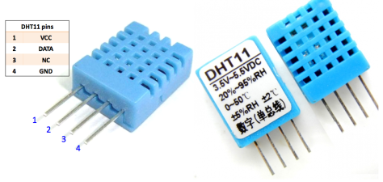
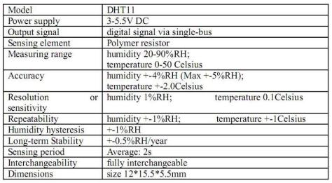
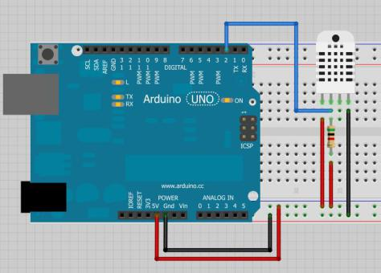

_Apuntes de un Ingeniero Electronico_
<br>
⋅⋅⋅⋅⋅⋅⋅⋅⋅⋅⋅⋅⋅⋅⋅⋅⋅⋅⋅⋅⋅⋅⋅⋅⋅⋅⋅⋅⋅⋅⋅⋅⋅⋅⋅⋅⋅⋅⋅⋅⋅⋅⋅⋅⋅⋅⋅⋅⋅⋅⋅⋅⋅⋅⋅⋅⋅⋅⋅⋅⋅⋅⋅⋅⋅⋅⋅⋅⋅⋅⋅⋅⋅⋅⋅⋅⋅⋅⋅⋅⋅⋅⋅⋅⋅⋅⋅⋅⋅⋅⋅⋅⋅⋅⋅⋅⋅⋅⋅⋅⋅⋅⋅⋅⋅⋅⋅⋅⋅⋅⋅⋅⋅⋅⋅⋅⋅⋅⋅⋅⋅⋅⋅⋅⋅⋅⋅⋅⋅⋅⋅⋅⋅⋅⋅⋅⋅

# __Sensor DTH11__   

Este tipo de sensor mide Humedad relativa y Temperatura. Lo malo de este sensor es que solo nos va a dar medidas enteras, es decir sin decimales, ya que la resolución que presenta es de 1% para la humedad relativa y de 1ºC para la temperatura. Pero compensa ya que presenta un valor muy económico para pequeños proyectos y que nos permite obtener medidas tanto para humedad como para temperatura.


Aqui se muestra una imagen con los pines que se pueden hacer interrupciones en cada placa.
<p align="center">

</p>   


### Caracteristicas del Sensor
<p align="center">

</p>     


### Conexion del Sensor con Arduino
<p align="center">

</p>   


### Ejemplo en ARDUINO  


```c
/*Sensor de Temperatura y Humedad DHT11
Instrucciones:
Recuerda descargar la libreria DHT para poder utilizar este sensor
Conectaremos el Sensor DHT11 a 5v y el pin de señal a la entrada digital 7
*/
#include "DHT.h"
#define DHTPIN 7
#define DHTTYPE DHT11
DHT dht(DHTPIN, DHTTYPE);
void setup() {
Serial.begin(9600);
dht.begin();
}
void loop() {  
int h = dht.readHumidity();// Lee la humedad
int t= dht.readTemperature();//Lee la temperatura
//////////////////////////////////////////////////
Serial.print("Humedad Relativa: ");                 
Serial.print(h);//Escribe la humedad
Serial.println(" %");                     
delay (2500);
///////////////////////////////////////////////////              
Serial.print("Temperatura: ");                  
Serial.print(t);//Escribe la temperatura
Serial.println(" C'");                   
delay (2500);
///////////////////////////////////////////////////             
Serial.println("ElectroCrea.com");                     
delay (3000);
Ser

}

```
